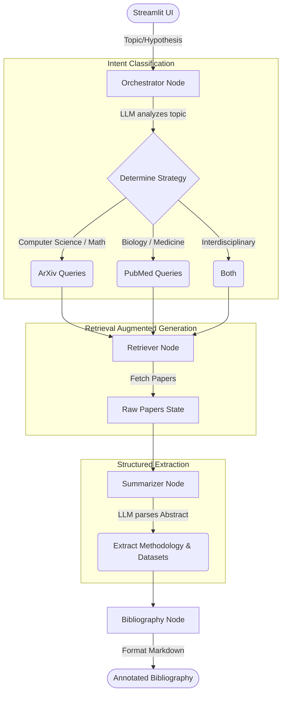

# 📚 Academic Research Co-Pilot

An intelligent agentic workflow designed to streamline academic research by automating the retrieval, analysis, and synthesis of research papers. Built using LangGraph, LangChain, and Groq, this tool acts as a co-pilot that accepts a research topic or hypothesis, intelligently routes the search, extracts key methodologies and datasets, and generates a formatted annotated bibliography.

## 🌟 Key Concepts & Implementations

- **Agentic Workflows (LangGraph)**: The application is built on a state-based graph architecture, where specific LLM nodes handle distinct parts of the pipeline (Orchestrator, Retriever, Summarizer, Bibliography).
- **Intent Classification & Routing**: The system doesn't just blindly search. It uses an LLM-powered orchestrator to classify the user's intent and dynamically decide the best search strategy (querying `arXiv` for physics/CS/math, `PubMed` for medicine/biology, or `both`). It also generates optimized search queries based on the raw input.
- **Retrieval-Augmented Generation (RAG)**: Connects real-time academic databases (arXiv, PubMed) to the LLM. This grounds the extraction process in factual, up-to-date research papers rather than relying solely on the LLM's pre-trained (and potentially hallucinated) knowledge.
- **Structured Information Extraction**: Uses LangChain's structured output capabilities (backed by Pydantic schemas) to force the LLM to consistently extract specific fields—namely `methodology` and `datasets`—from dense academic abstracts.
- **Observability (LangSmith)**: Compatible with LangSmith for deep tracing of the LangGraph execution, allowing visibility into the LLM calls, latency, intent classification routing decisions, and token usage.

## 🛠 Tech Stack

- **Frameworks & Orchestration**: [LangGraph](https://python.langchain.com/docs/langgraph) & [LangChain](https://python.langchain.com/)
- **Large Language Models (LLMs)**: [Groq](https://groq.com/) (`llama-3.3-70b-versatile` for orchestration, `llama3-70b-8192` for extraction)
- **User Interface**: [Streamlit](https://streamlit.io/)
- **Data Sources / APIs**: `arxiv` API, `BioPython` (Entrez / PubMed API)
- **Data Validation**: Pydantic

## 🔄 System Architecture & Flow

The workflow is structured as a directed acyclic graph (DAG) where the state is passed between specialized nodes.



## 🧠 How It Works (Step-by-Step)

1. **Input**: The user provides a research topic via the Streamlit interface.
2. **Orchestrator Node**: 
   - A `llama-3.3-70b-versatile` model evaluates the topic.
   - It outputs a Pydantic `SearchStrategy` object, selecting the target database (`arxiv`, `pubmed`, or `both`) and generating optimized search queries.
3. **Retriever Node**: 
   - Takes the optimized queries and queries the selected APIs.
   - Fetches up to 5 relevant papers and stores their metadata and abstracts in the graph state.
4. **Summarizer Node**: 
   - A `llama3-70b-8192` model iterates through the retrieved abstracts.
   - Using a strict `ExtractionSummary` Pydantic schema, it pulls out the specific methodologies used and any datasets explicitly mentioned.
5. **Bibliography Node**: 
   - Synthesizes the raw metadata and the LLM-extracted summaries into a clean, annotated markdown bibliography for the user.

## 🚀 Getting Started

### Prerequisites

- Python 3.14+ (as specified in `pyproject.toml`)
- A [Groq API Key](https://console.groq.com/)

### Installation

1. Clone the repository and navigate to the project directory:
   ```bash
   git clone <your-repo-url>
   cd Simpleragent
   ```
2. Install dependencies (the project uses `uv` for dependency management):
   ```bash
   uv sync
   ```
3. Create a `.env` file in the root directory and add your Groq API key:
   ```env
   GROQ_API_KEY=your_groq_api_key_here
   
   # Optional: Enable LangSmith Tracing
   LANGCHAIN_TRACING_V2=true
   LANGCHAIN_API_KEY=your_langchain_api_key
   LANGCHAIN_PROJECT=academic-research-copilot
   ```

### Running the Application

Start the Streamlit application:
```bash
streamlit run app.py
```
